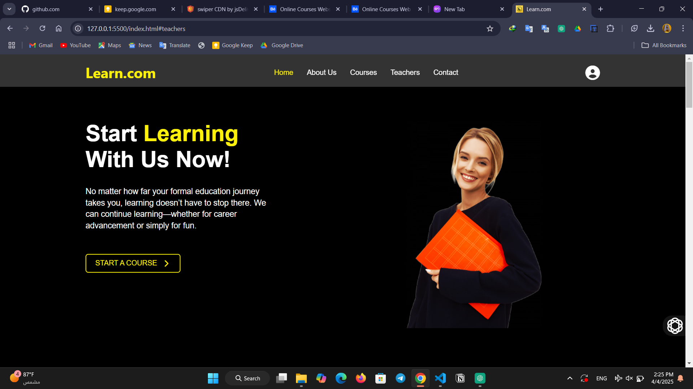

# Online Courses Web Project

This project is a web-based platform designed to provide users with access to a variety of online courses. The platform allows users to browse, enroll, and learn from courses in different categories, making education accessible and convenient.

## Features
- **User Authentication**: Secure login and registration system.
- **Course Catalog**: Browse courses by category or search for specific topics.
- **Responsive Design**: Fully functional on both desktop and mobile devices.
- **Progress Tracking**: Users can track their learning progress.
- **Admin Panel**: Manage courses, users, and content.

## Technologies Used
- **Frontend**: HTML, CSS, JavaScript, React
- **Backend**: Node.js, Express.js
- **Database**: MongoDB
- **Other Tools**: Git, npm, REST APIs

## Screenshots

### Home Page


### Courses


### Teachers


## Installation
1. Clone the repository:
    ```bash
    git clone https://github.com/yourusername/online-courses-web-project.git
    ```
2. Navigate to the project directory:
    ```bash
    cd online-courses-web-project
    ```
3. Install dependencies:
    ```bash
    npm install
    ```
4. Start the development server:
    ```bash
    npm start
    ```

## License
This project is licensed under the [MIT License](LICENSE).

## Contact
For any inquiries, please contact [aihamjassar@gmail.com](mailto:aihamjassar@gmail.com).
